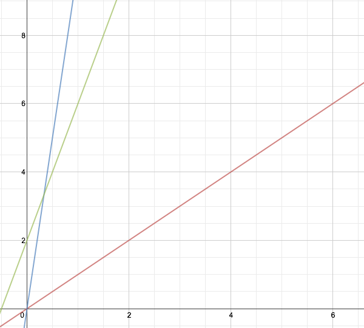
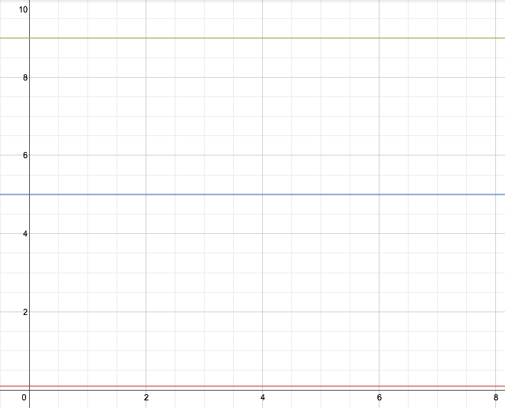
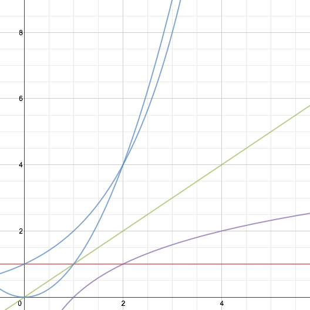

# BIG O

Computer science for n00bs, by n00bs

!SLIDE
## Rate of Growth

!SLIDE
## How's it shaped?

We don't care about angle or location.

!SLIDE
## Linear Growth

~~~SECTION:notes~~~

You can see that some have steeper slopes than others, and some have a bit of "overhead"; they take a bit of time to get started. So in absolute terms, they are not equal, and you might optimize an algorithm to improve from one to another.

But in Big O terms, these are all the same. That's because the time taken grows proportionally to the size of the problem; that's called "O(N)". They look distinctive in that they are shaped like straight lines with some slope.

~~~ENDSECTION~~~

!SLIDE
## O(1)

~~~SECTION:notes~~~

These are all O(1), even though one is "always takes 0.1 seconds" and another takes 9. Yes, you might care about that. But Big O doesn't, because it's about growth. For Big O, we just care that the time is constant. There's no such thing as O(10). We just hand-wave and say, "eh, it's O(1)."

~~~ENDSECTION~~~

!SLIDE
## Linear vs Non-Linear Growth

