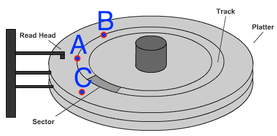
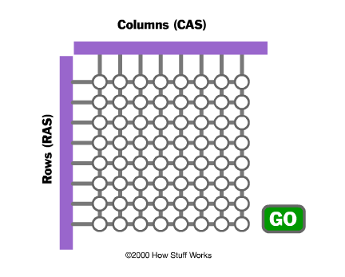

# Our Big O Problem

    @@@ Ruby
    [['key1', 'val1'], ['key2', 'val2']...]

~~~SECTION:notes~~~

In the case of our hash, N is the number of entries already in the hash. What we want to know is: if the hash has 1,000 entries and it takes N amount of time to read or write a value, then we change it to have 2,000 entries, does that affect the read/write time, and if so, how?

Here we'll have to walk through half the entries, on average, to find the one we want. So it will take about 1/2 N operations, which we call O(N).

~~~ENDSECTION~~~

!SLIDE
# What can we use that's O(1)?

!SLIDE

# Array lookup by index.

    @@@ Ruby
    some_array[328]

~~~SECTION:notes~~~
TADA!
~~~ENDSECTION~~~

!SLIDE
# Um... how does THAT work?

~~~SECTION:notes~~~

Why does this always take the same amount of time, regardless of the index? Because of how RAM works.

~~~ENDSECTION~~~

!SLIDE
# Spinning Disk vs RAM

!SLIDE
# Spinning Disk

(Adapted from  http://www.read.cs.ucla.edu/111/2006fall/notes/lec15)

~~~SECTION:notes~~~
On a spinning disk, if you're reading from point A, you can move the read head and read from point B faster than you can get over to point C. This is why we used to defrag hard drives - to keep related data close together and cut down on seek times.
~~~ENDSECTION~~~

!SLIDE
# RAM!

(From HowStuffWorks.com)

~~~SECTION:notes~~~
RAM doesn't have this problem - that's the "Random Access" part. Why?

It stores data in a grid and uses charges on a row/column pair to read or write a given address. Any location takes the same amount of time.
~~~ENDSECTION~~~

!SLIDE
# Arrays and RAM

    @@@ Ruby
    some_array[328]
    # item location is:
    # array_start_location +
    #  (pointer size x index)

~~~SECTION:notes~~~
An array in Ruby will exist in RAM, and be laid out so that each slot is the same length - as much space as is needed for one pointer to its value. So when Ruby knows your array is at location X, it will know that item 12 in the array is at location X + 12 in RAM and can access it immediately.
~~~SENDSECTION~~~
