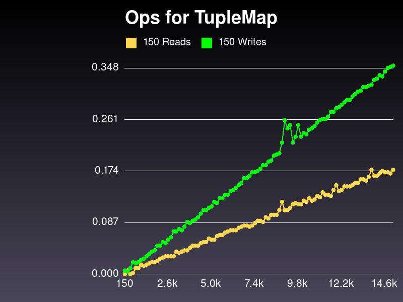

# Our Big O Problem

    @@@ Ruby
    [['hi', 'hola'], ['cat', 'gato']...]

!SLIDE

~~~SECTION:notes~~~
Explain Carefully! Size of hash is X.

Random reads and insertions. Insert is N, read averages 1/2 N.

Looks linear (not proof).
~~~ENDSECTION~~~

!SLIDE
# What can we use that's O(1)?

!SLIDE

# Array lookup by index: O(1)

    @@@ Ruby

    # Equal lookup times
    some_array[328]
    some_array[5]

~~~SECTION:notes~~~
TADA!
~~~ENDSECTION~~~

!SLIDE
# Why does *that* work?

## Because RAM

!SLIDE
# Arrays and RAM

Each array item is as big as a pointer.

    @@@ Ruby
    some_array[328]
    # item location is:
    # array_start_location +
    #  (index x pointer_size)

~~~SECTION:notes~~~
Calculate RAM address, bada bing.
~~~ENDSECTION~~~
