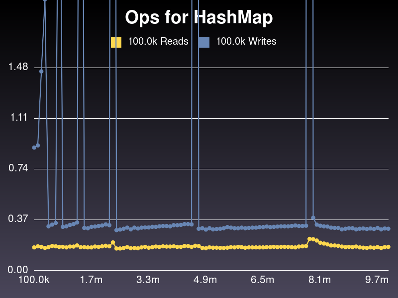
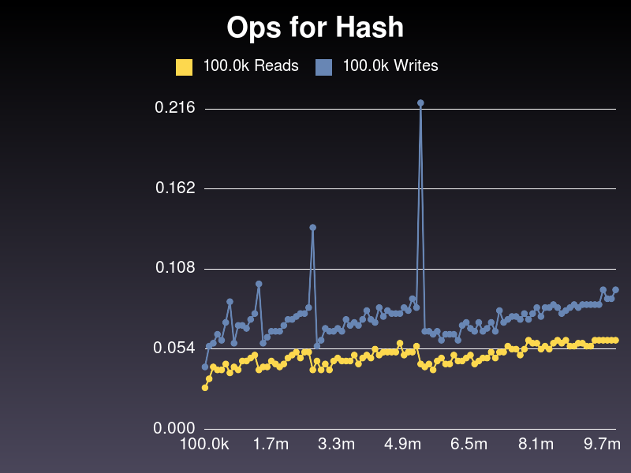
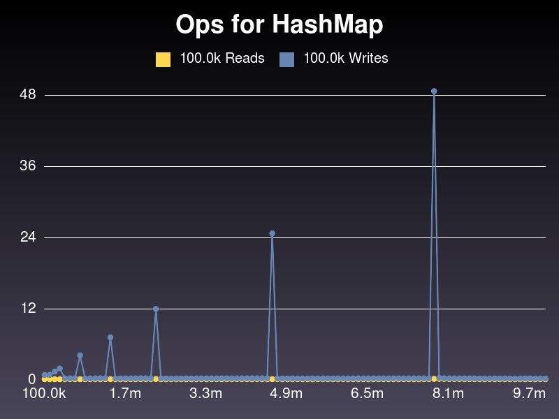
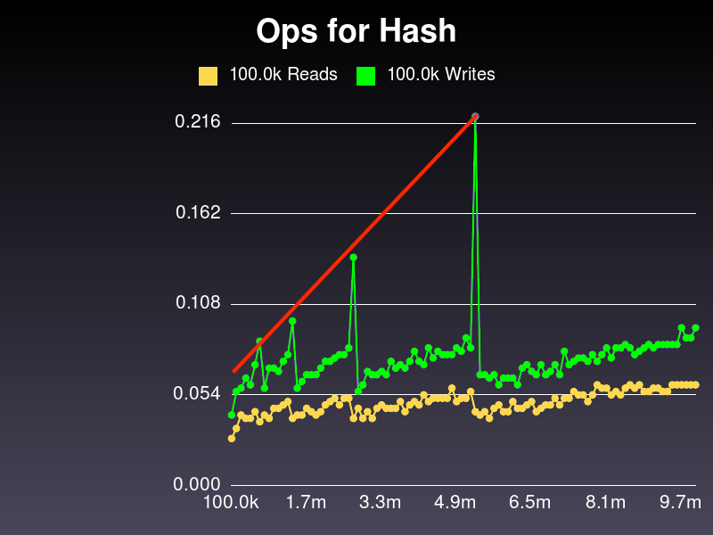
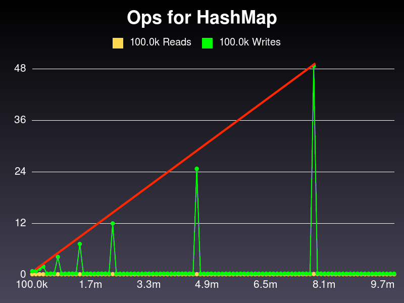
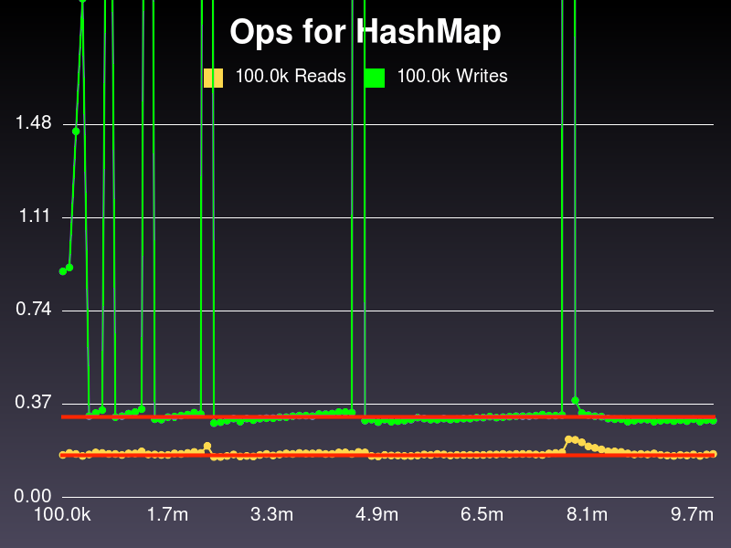

!SLIDE
# Did we get O(1)?

We want a nice, flat line.

!SLIDE
# LET'S... SEE... THE... GRAPH!!!

~~~SECTION:notes~~~
ARE YOU READY FOR THE GRAPH!!!?
~~~ENDSECTION~~~

!SLIDE

~~~SECTION:notes~~~
APPLAUSE! ... Confusion. Analysis.
~~~ENDSECTION~~~

!SLIDE
# Spikes == Redistribution

!SLIDE
# Hmmm. What about Hash?

!SLIDE

!SLIDE
# How big WERE our spikes?

!SLIDE
# Ouch

!SLIDE
# But Wait!

Both have linearly-increasing spikes
<!-- HERE show Hash and HashMap side by side, or somehow illustrate that the spikes on both are linear -->

!SLIDE
# Zoom again

!SLIDE
# Success!

- Reads always <= 10 steps
- Same for writes... unless growth needed

!SLIDE
# It's OK!

- Growth **must** take N steps, but...
- As it gets slower, also gets less frequent
- **Average write speed** stays same
- Amortized analysis: O(1)
- Woo!

!SLIDE

!SLIDE
# Ship it!

!SLIDE
# Optimizations?

- Trade more memory at a time
- Rehash in bg thread?
- Implement in C

~~~SECTION:notes~~~
Not a language issue, an algo issue. C might change Y but not shape.
~~~ENDSECTION~~~

!SLIDE
# Applications

- Hashes are O(1) multi-tool
- Dynamo DBs (Riak, Cassandra) are "distributed hash tables"
