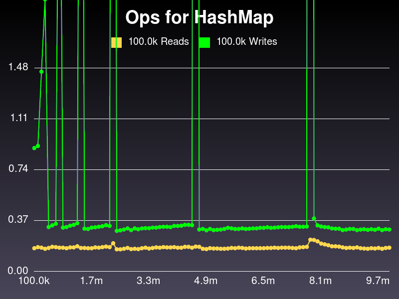
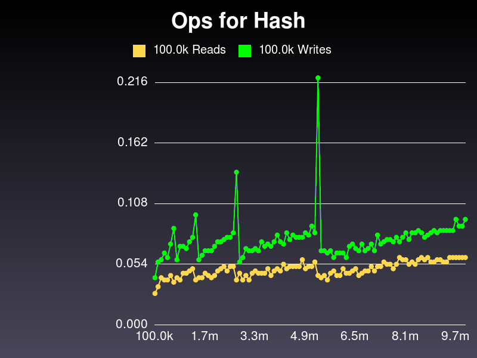
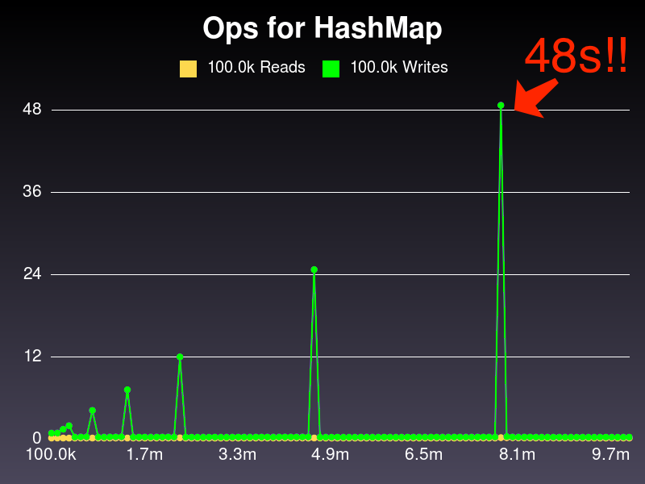

# Whence the Raw Hash Value?

Remember:

1. Decide on a starting size
2. Compute a key's raw hash value
3. `index = raw_hash_value % array_size`

Eh?

!SLIDE
# Try 1: Roll our own

    @@@ Ruby
    def raw_digest(key)
      # Convert to Unicode code points
      key.unpack('U*').join('').to_i
    end

    raw_digest('woah')   #=> 11911197104
    raw_digest('yarrr!') #=> 1219711411411433

!SLIDE
# Whoops

    @@@ Ruby
    raw_digest(:thingy)  #=> NoMethodError
    raw_digest([1,2,3])  #=> NoMethodError

!SLIDE
# Try 2: Object IDs
    @@@ Ruby
    def raw_digest(key)
      # Everything is an object!
      key.object_id
    end

!SLIDE
# Success?
    @@@ Ruby
    raw_digest(:thingy)  #=> 522568
    raw_digest([1,2,3])  #=> 70121947506720

!SLIDE
# Success!
    @@@ Ruby
    key    = [1,2,3]
    h      = HashMap.new
    h[key] = 'stuff'
    h[key] #=> 'stuff'

!SLIDE
# Wait...
    
    @@@ Ruby
    h = HashMap.new
    h[[1,2,3]] = 'stuff'
    h[[1,2,3]] #=> nil
    h['oh']    = 'noes'
    h['oh']    #=> nil

!SLIDE
# Support "same value" keys
    @@@ Ruby
    'foo'         == 'foo'
    [1,2,3]       == [1,2,3]
    {hi: 'there'} == {hi: 'there'}

!SLIDE
# Therefore...
    @@@ Ruby
    # Assuming obj1.eql?(obj2)
    hash[obj1] = 'val'
    hash[obj2] #=> 'val'`

!SLIDE
# Cheater Pantses

Ruby uses the `.hash` method for this.

!SLIDE
# .hash

    @@@ Ruby
    [1,2,3].hash #=> -262151465130803218
    # Equivilent object? Same hash val
    [1,2,3].hash #=> -262151465130803218

!SLIDE
# "Same value" is negotiable

    @@@ Ruby
    class Critter < Struct.new(
      :family, :genus, :species
     )
      # Species Schmecies!
      def eql?(other)
        other.class  == self.class &&
        other.family == family &&
        other.genus  == genus
      end
      # Reflects our idea of equality
      def hash
        (family.hash + genus.hash) / 2
      end
    end

!SLIDE
# See?
    
    @@@ Ruby
    opossum1 = Critter.new('A', 'B', 'C')
    opossum2 = Critter.new('A', 'B', 'X')

    hash[opossum1]    = 'tricky'
    hash[opossum2]  #=> 'tricky'

!SLIDE
# (Bonus Tip)

`.hash` is also used by `Set` to determine uniqueness

!SLIDE
# OK - It works!

!SLIDE
# But... Speed, man! Speed!

!SLIDE

!SLIDE
# Hmmmmmmm

!SLIDE

!SLIDE
# Oh...

!SLIDE

!SLIDE
# Well

!SLIDE
# So... is it O(1)?

- O(N)-ish while hash collisions grow
- "Resets" performance after we rehash
- But man, rehashing is a beast

!SLIDE
# Next

Maybe I could see how Rubinius does it?
