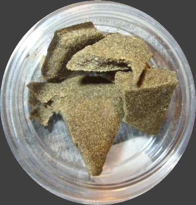

# "Hash"

!SLIDE

!SLIDE
# Not this

(From Wikipedia)

!SLIDE
# Or this

(From Wikipedia)

!SLIDE
# Or even this

    @@@ Ruby
    Digest::MD5.digest('hi') 
    # => "I\xF6\x8A\\\x84\x93\xEC..."

!SLIDE
# Hash - a data structure

    @@@ Ruby
    h = {} # or Hash.new
    h['appetizer'] = 'fruit salad'
    h['appetizer'] #=> 'fruit salad'
