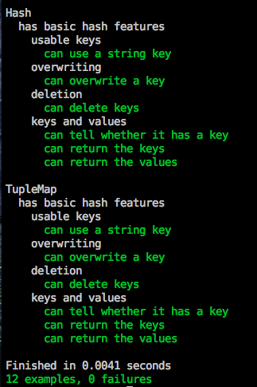

!SLIDE
# No Problem!

!SLIDE
# Guts

    @@@ Ruby
    [['hi', 'hola'], ['cat', 'gato']...]

!SLIDE
# Syntactic Sugar

    @@@ Ruby
    class TupleMap

      def 
        # read
      end

      def []=(key, value)
        # write
      end
    end

!SLIDE
# Usage

    @@@ Ruby
    h = TupleMap.new
    h['hokey']   = 'pokey'
    h['hokey'] #=> 'pokey'

!SLIDE
# Passing Tests

