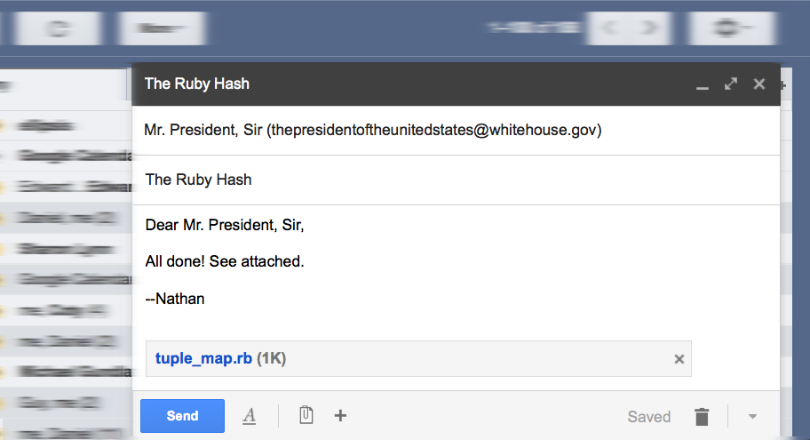

# Done!

!SLIDE
# Presidential Disapproval

~~~SECTION:notes~~~
"My eggheads tell me that this hash of your is not up to standards.
They say it's O(N) and it needs to be O(1).
Now, I don't know exactly what that means, but I need you to fix it."

I was like, "You're changing the requirements? Is this what happened
to healthcare.gov?"

But the phone was dead.
~~~ENDSECTION~~~

!SLIDE

# O(N) != O(1)

~~~SECTION:notes~~~
O(1) is a big feature of hash tables. What's it?
~~~ENDSECTION~~~
